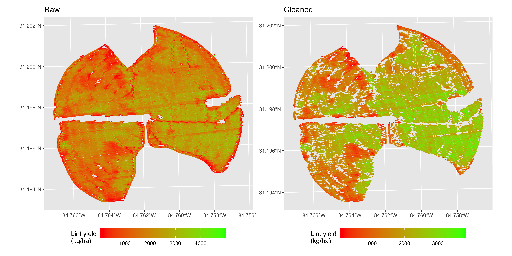

```{r setup, include=FALSE}
knitr::opts_chunk$set(echo = FALSE)
library(dplyr)
```


# Introduction  

Yield monitor data from various crops is known for containing erroneous yield values due to multiple causes, including partially-filled header, abrupt changes in travel velocity, poor GPS signal, among others. These erroneous data points need to be removed to ensure data quality before yield maps can be used for practical purposes. Studies have reported removing from 10% to 50% of yield monitor data points due to poor data quality, with significant differences in field-level yield average, standard deviation, range, and coefficient of variation between raw and cleaned yield monitor data (Sudduth et al., 2012).   

Yield Editor software (Sudduth et al., 2007; Sudduth et al., 2012) was developed to provide a clear workflow for yield monitor data cleaning and includes a total of 12 filters/steps. These are 

- Grain flow delay  
- Start pass delay  
- Minimum and maximum velocity  
- Smooth velocity  
- Minimum swath  
- Minimum and maximum yield  
- Position  
- Manual  

Although Yield Editor was developed and tested on multiple crops, cotton was not part of the original set of tested crops. With the increasing adoption of cotton yield monitors, there is a need to understand to what extent cotton yield monitor data is impacted by different sources of error. Moreover, Yield Editor is a windows-based point-and-click software useful for practitioners. This limits its use and adoption because i) non-windows users have limited options to access it, and ii) though the software offers batch processing, it is not written in a common scientific programming language to be easily expanded for scientists.  

The overall objectives of this research are to  

1. translate the current filters implemented in Yield Editor into an R package to be used by scientists;  
2. deploy the R package into a web-based application that can be easily used by practicioners and independent of operating system; and   
3. apply the filtering functions to cotton yield monitor data sets to assess the extent to which these data are affected by erroneous data points.  

This report includes the development and application of **5 filters** used in Yield Editor, and will focus on exploring **objective 3**.  

# Material and Methods  
## Field information  
Cotton yield monitor data used in this report was collected in 2019 at the field Shy North belonging to the grower Keith Bowen. Detailed agronomic information such as planting date, variety, fertilization, seeding rate, chemical control program, irrigation, among others are beyond the scope of this report and were not included. Cotton was harvested between November 29th and December 2nd.  

Lint yield was calculated assuming that the column VRYILDBAL was lint yield in ba/ac, assuming 480 lbs of lint/ba, and transforming to SI unit of kg/ha.    

## Yield Editor filters implemented  
This report implemented 5 Yield Editor filters:  
**1. Minimum and maximum yield**  
The yield filter utilizes a histogram approach to define lower and upper boundaries for acceptable yield values. The algorithm extracts the 10% and 99% percentiles of the yield distribution, expands them in 25%, and uses these expanded lower and upper boundaries to define the acceptable range of yield values.  

**2. Minimum and maximum velocity**   
The velocity filter utilizes the same concept as described above, but with different parameter values. The algorithm extracts the 8% and 90% percentiles of the velocity distribution, expands them in 18%, and uses these expanded lower and upper boundaries to define the acceptable range of velocity values.  

**3. Position**  
The position filter utilized a similar concept as described above, and incorporates a 40-m negative buffer. The implementation of the original filter proposed by Sudduth et al. (2012) did not remove any data points on our data set. Thus, the position filter was adapted to keep only observations within the negative buffer of 40-m from the field boundary. This approach removes any data points outside of the field boundary, and also data points from end-rows and combine maneuvering areas.  

# Results  
## **Raw** yield data  

The raw yield data set had 142,944 observations, ranging from 18 to 515,949 kg lint/ha (Fig. 1), with a standard deviation (sd) of 2666 and a coefficient of variation of 146%.
```{r fig1, out.width="60%", fig.align="center", fig.cap="Figure 1. Raw yield data distribution"}

```
  
  
For displaying purposes only, the raw yield data was filtered to contain only observations with yield less than 5,000 kg lint/ha. Low yield areas were observed across the field, and distinctively present at end-rows (Fig. 2).  

```{r fig2, out.width="60%", fig.align="center", fig.cap="Figure 2. Raw yield data map."}

```

## **Cleaned** yield data  
### Individual filter effect  
When considered separately, the **minimum and maximum yield filter** was the one with the largest impact on reducing standard deviation (from 2666 on raw data to 741) and coefficient of variation (from 146% on raw data to 41%), while removing only ~1% of total observations (Table 1). The position filter removed the most observations (7% of total), with little impact on standard deviation and coefficient of variation.  


```{r table1 }
read.csv("../output/table1.csv") %>%
  rename(`Filter type`=type,
         `Proportion of obs. kept`=n_pctoriginal) %>%
  knitr::kable(caption = "Table 1. Effect of individual filters on lint yield statistics.")
```

### Combined filter effect  
These different filters are supposed to be used in combination. This is important as although there is overlap among filters (i.e., some observations are flagged by multiple filters), they also work complimentary with some observations being flagged by a single filter.  

When combined, the lowest standard deviation and coefficient of variation was observed with the 5 filters applied (Table 2). This was also the scenario that removed the most observations, keeping 92% of the original data points. Both mean and median lint yield were larger using all 5 filters compared to the raw data, indicating that in the case of this data set, **uncleaned data underestimated yield**.   

```{r table2 }
read.csv("../output/table2.csv") %>%
  rename(`Filter type`=type,
         `Proportion of obs. kept`=n_pctoriginal) %>%
  knitr::kable(caption = "Table 2. Effect of combined filters on lint yield statistics.")
```

All yield data points flagged by one or more combined filters were removed, with their location in the field shown on Fig. 3. 

```{r fig3, out.width="80%", fig.align="center", fig.cap="Figure 3. Yield data points removed by combined filters."}

```

The majority of yield points removed were due to the **position filter** alone (within a 40-m negative buffer from the field boundary), followed by the filters **minimum yield, minimum yield + position, maximum yield, minimum velocity**, and others (Table 3).  

```{r table3}
read.csv("../output/table3.csv") %>%
  filter(n<10000) %>%
  knitr::kable(caption = "Table 3. Number of yield observations flagged by one or more filters.") 

```

A side-by-side comparison between raw and cleaned cotton yield monitor data maps is shown on Fig. 4. By removing yield and velocity outliers and areas known for causing erroneous yield values (near field border), it becomes clearer to identify high and low yielding areas based on the yield monitor cleaned map.   
```{r fig4, fig.align="center", fig.cap="Figure 4. Raw and cleaned cotton yield monitor data."}

```


# Summary and next steps  
In summary:  
- Raw yield monitor data contains erroneous observations that need to be removed.  
- Here we implemented **5 filters** included on Yield Editor software.  
- The most important individual filter was the **minimum and maximum yield**.  
- The combination of **all 5 filters** produced data with the **least variability** based on theoretically sound reasons.  

Next steps:  

1. Implement other filters identified as important by Sudduth et al. (2012), like the **delay and overlap filters**.   

2. Test filters on more cotton yield monitor data sets and obtain a generalizable measure of importance for cleaning this type of data.  

3. Continue software development towards publishing an R package for a scientific audience, accompanied by a web-based application for practitioners.  


